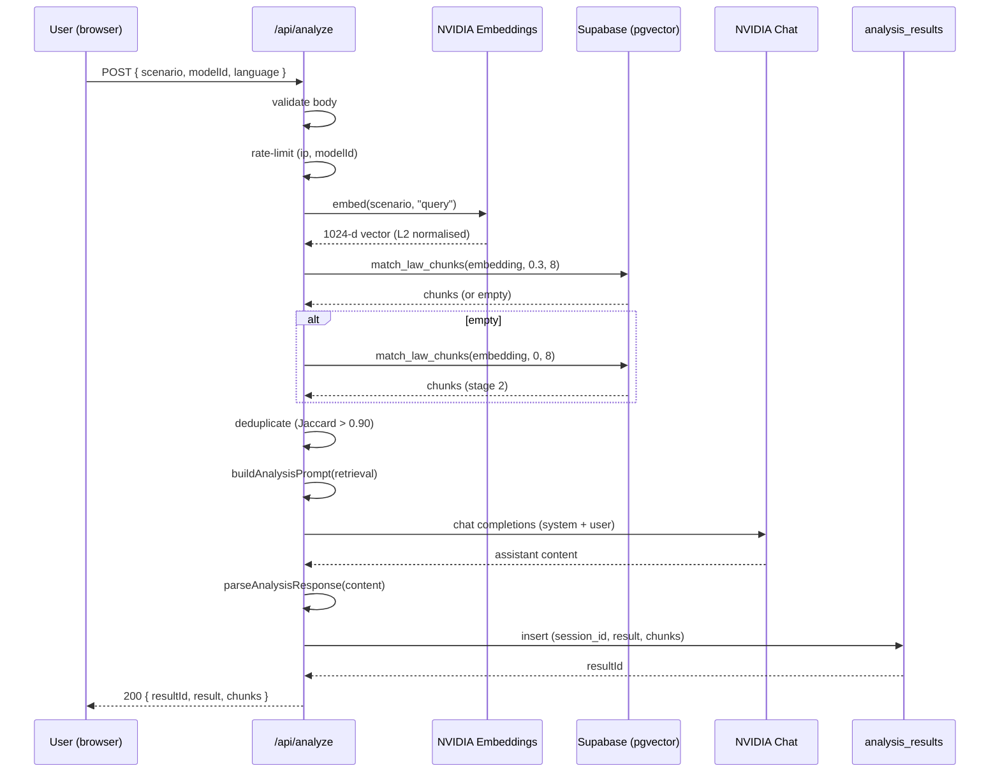
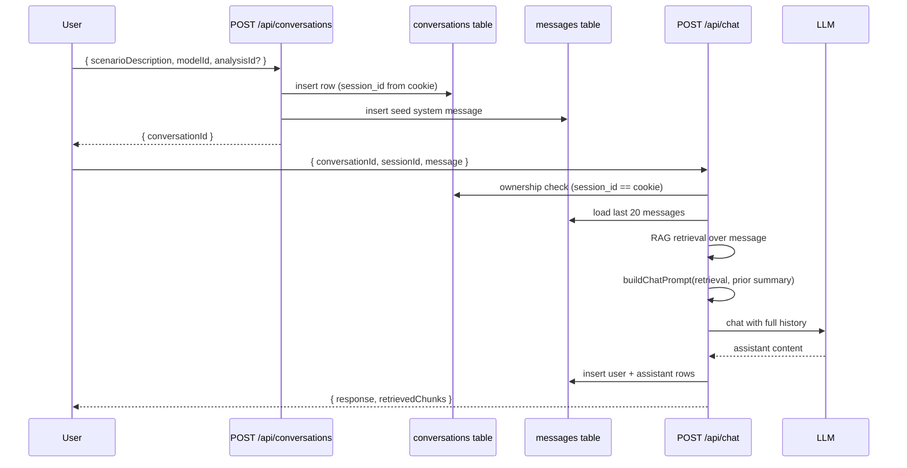

# HUKM Architecture

## Overview

HUKM is a server-rendered Next.js application that runs a RAG pipeline over a
pgvector-indexed corpus of Ethiopian criminal law and orchestrates an
LLM-driven 7-step analysis. There is no client-side database access — the
browser only ever talks to `/api/*` routes; Supabase is reached exclusively
through the server-only client in `lib/supabase.ts`.

## High-level data flow

```
                ┌──────────────┐        ┌────────────────────┐
                │   Browser    │   1    │  Next.js App Route │
   user input ─►│ ScenarioForm ├───────►│  /api/analyze      │
                └──────────────┘        └────────┬───────────┘
                                                 │
                                       2  embed  ▼
                                       ┌────────────────────┐
                                       │ NVIDIA embeddings  │
                                       │ nv-embedqa-e5-v5   │
                                       └────────┬───────────┘
                                                │ 1024-dim
                                                ▼
                                       ┌────────────────────┐
                                       │ Supabase pgvector  │
                                       │ match_law_chunks() │ 3
                                       └────────┬───────────┘
                                                │ chunks
                                                ▼
                                       ┌────────────────────┐
                                       │ Jaccard dedup      │ 4
                                       └────────┬───────────┘
                                                │ deduped
                                                ▼
                                       ┌────────────────────┐
                                       │ buildAnalysisPrompt│ 5
                                       └────────┬───────────┘
                                                │ system prompt
                                                ▼
                                       ┌────────────────────┐
                                       │ NVIDIA chat API    │ 6
                                       │ z-ai/glm4.7 (default), │
                                       │ fallback chain     │
                                       └────────┬───────────┘
                                                │ raw text
                                                ▼
                                       ┌────────────────────┐
                                       │ parseAnalysisResp. │ 7
                                       │ (never throws)     │
                                       └────────┬───────────┘
                                                │ AnalysisResult
                                                ▼
                                       ┌────────────────────┐
                                       │ Supabase insert    │ 8
                                       │ analysis_results   │
                                       └────────┬───────────┘
                                                │ resultId
                                                ▼
                                          /results/[id]
```



## Modules

| File                       | Responsibility                                                |
| -------------------------- | ------------------------------------------------------------- |
| `lib/env.ts`               | Validates required env vars at startup. Server-only.          |
| `lib/types.ts`             | Shared TypeScript interfaces.                                 |
| `lib/models.ts`            | Model registry: ids, display names, tiers, fallback chain.    |
| `lib/logger.ts`            | Structured key/value logger.                                  |
| `lib/supabase.ts`          | Cached service-role Supabase client. Server-only.             |
| `lib/session.ts`           | `hukm_session` HttpOnly cookie helpers.                       |
| `lib/embeddings.ts`        | `embed()` — NVIDIA embeddings + L2 normalisation.             |
| `lib/retrieval.ts`         | Two-stage `match_law_chunks` retrieval; returns `RetrievalResult`. |
| `lib/similarity.ts`        | Jaccard dedup over tokenised chunk content.                   |
| `lib/prompts.ts`           | `buildAnalysisPrompt`, `buildChatPrompt`, retrieval rendering.|
| `lib/parser.ts`            | `parseAnalysisResponse` — never throws.                       |
| `lib/nvidia.ts`            | `callChat`, `callChatWithFallback`, `streamChat`.             |
| `lib/ratelimit.ts`         | Tiered, swappable rate limiter.                               |
| `lib/ownership.ts`         | `isConversationOwner`, `isAnalysisOwner`.                     |
| `lib/http.ts`              | JSON error envelope.                                          |

## RAG pipeline detail

### 1. Embedding

`embed(text, "query")` → calls `https://integrate.api.nvidia.com/v1/embeddings`
with model `nvidia/nv-embedqa-e5-v5` and `input_type: "query"`. Output is a
1024-dimensional vector. The vector is L2-normalised before being passed to
pgvector — `match_law_chunks` uses `vector_cosine_ops`, which only behaves
correctly when both sides are unit-length.

### 2. Two-stage retrieval

```
Stage 1: match_law_chunks(embedding, threshold = 0.3, count = 8)
   if rows > 0 → use these (stage = 1)
Stage 2: match_law_chunks(embedding, threshold = 0.0, count = 8)
   use whatever the ANN search produces (stage = 2)
```

The stage is recorded in `RetrievalResult.stage` and surfaced to the prompt
builder so the model can downgrade confidence when only the fallback stage
produced anything.

### 3. Deduplication

`deduplicateChunks` tokenises each chunk's content (lowercase, strip
punctuation, drop tokens < 3 chars), sorts by similarity descending, and
discards any chunk whose Jaccard similarity to an already-kept chunk
exceeds 0.90.

### 4. Prompt construction

`buildAnalysisPrompt({ retrieval, language })` emits five blocks in order:

1. `[ROLE]` — identity statement.
2. `[ANTI-HALLUCINATION RULES]` — verbatim rules from the spec.
3. `[CONFIDENCE RULES]` — exact thresholds for HIGH/MEDIUM/LOW.
4. `[RETRIEVED ARTICLES]` — chunks, similarities, and a summary block.
5. `[OUTPUT FORMAT]` — strict JSON schema.

`buildChatPrompt` swaps blocks 3 + 5 for prose-output rules and a prior-
analysis context block. It explicitly forbids JSON output.

### 5. Model invocation

`callChatWithFallback({ modelId, messages })` walks the fallback chain
returned by `getFallbackChain(modelId)`:

```
[ requestedId, ...FALLBACK_MODELS ]
```

Each candidate is retried only on transient errors (5xx, 429, 408 or
network). Validation/auth failures (4xx other than 429) bubble up
immediately so callers get a clean 400/401, not a flapping cascade.

### 6. Parser

`parseAnalysisResponse` is the safety net. The contract is:

- Strip code fences (```json … ```).
- Locate the outermost JSON object substring.
- `JSON.parse` inside a `try`/`catch`.
- For each required field, type-check; substitute a meaningful fallback
  string on miss.
- Always preserve the raw input in `rawResponse`.
- If more than half the required fields were missing, downgrade the
  confidence level to `NEEDS_REVIEW`.

## Conversation flow



## Database schema

The schema is owned by Supabase migrations in the data ingestion repo. The
shapes the app expects:

```sql
law_chunks (
  id BIGSERIAL PRIMARY KEY,
  document_name     TEXT,
  article_reference TEXT,
  content           TEXT,
  metadata          JSONB,
  embedding         VECTOR(1024)
);

conversations (
  id                   UUID PRIMARY KEY DEFAULT gen_random_uuid(),
  session_id           TEXT NOT NULL,
  user_id              TEXT,
  scenario_description TEXT,
  model_id             TEXT NOT NULL,
  confidence_level     TEXT,
  is_civil_matter      BOOLEAN DEFAULT FALSE,
  needs_clarification  BOOLEAN DEFAULT FALSE,
  created_at           TIMESTAMPTZ NOT NULL DEFAULT NOW(),
  updated_at           TIMESTAMPTZ NOT NULL DEFAULT NOW()
);

messages (
  id              UUID PRIMARY KEY DEFAULT gen_random_uuid(),
  conversation_id UUID NOT NULL REFERENCES conversations(id) ON DELETE CASCADE,
  role            TEXT NOT NULL CHECK (role IN ('user', 'assistant', 'system')),
  content         TEXT NOT NULL,
  metadata        JSONB,
  created_at      TIMESTAMPTZ NOT NULL DEFAULT NOW()
);

analysis_results (
  id             UUID PRIMARY KEY DEFAULT gen_random_uuid(),
  session_id     TEXT NOT NULL,
  scenario_input JSONB NOT NULL,
  result         JSONB NOT NULL,
  model_id       TEXT NOT NULL,
  created_at     TIMESTAMPTZ NOT NULL DEFAULT NOW()
);
```

RPCs the app calls (all read-only on data; only metadata writes happen via
table inserts):

- `match_law_chunks(query_embedding VECTOR(1024), match_threshold FLOAT, match_count INT)`
- `get_recent_conversations(p_session_id TEXT, p_limit INT)`
- `get_conversation_messages(p_conversation_id UUID)`

## Security posture

- **Service role key** is imported only via `lib/supabase.ts`, which has
  `import "server-only"` at the top. Any client component that
  transitively imports it will fail to compile.
- **Session ownership** is checked on every read or write that touches
  user data (`isConversationOwner`, `isAnalysisOwner`).
- **Rate limits** are applied per-(IP, modelId) on both `/api/analyze` and
  `/api/chat`; premium models get a 10 req/min cap.
- **Input validation** rejects out-of-bounds lengths, unknown model IDs,
  and unknown languages before any external call.
- **CSRF** — the chat API requires a `sessionId` body parameter that must
  match the value of the HttpOnly cookie. A request from another origin
  cannot read the cookie and so cannot forge a matching body.

## Failure modes

| Scenario                         | Behaviour                                              |
| -------------------------------- | ------------------------------------------------------ |
| NVIDIA embeddings 5xx            | Retrieval returns empty result; analysis runs with LOW confidence. |
| NVIDIA chat 5xx for primary model| Fallback chain attempted; if all fail, 503 to user.     |
| LLM returns malformed JSON       | Parser returns a `NEEDS_REVIEW` result with the raw text. |
| Supabase insert fails            | API returns `PERSIST_FAILED` with HTTP 500.             |
| Conversation owned by another session | API returns `NOT_FOUND` (404), not 403, to avoid leaking existence. |
| Rate limit exceeded              | 429 with `Retry-After` header.                          |

## Performance

A typical `/api/analyze` request:

| Stage              | Latency         |
| ------------------ | --------------- |
| Embedding          | 200–500 ms      |
| pgvector match     | 30–80 ms        |
| Jaccard dedup      | < 5 ms          |
| Prompt build       | < 1 ms          |
| LLM call (glm4.7)  | 2–6 s           |
| Parse + persist    | 30–80 ms        |

Total end-to-end: typically 3–7 seconds.
